```{r setup, include=FALSE, eval=TRUE}
options(htmltools.dir.version = FALSE)
knitr::opts_chunk$set(
	eval = FALSE,
	fig.align = "center",
	message = FALSE,
	warning = FALSE
)
```

```{r xaringanExtra, include=FALSE, eval=TRUE}
xaringanExtra::use_tile_view()
xaringanExtra::use_clipboard()
xaringanExtra::use_extra_styles(hover_code_line = TRUE,
                                mute_unhighlighted_code = FALSE)
```

```{r packages, include=FALSE, eval=TRUE}
library(tidyverse)
library(gtsummary)
library(flextable)
library(labelled)
library(huxtable)
library(countdown)
library(emo)
```


class: slide-titulo

---


class: slide-r

---

name: recap-funcao-1

## Funções

> Uma função é um conjunto de instruções organizadas para realizar uma tarefa específica.

Para fins didáticos, uma função possui:

- **Nome**: é o nome da função (e.g., `mean`, `sd`).

- **Argumentos**: recebem valores (ou possuem valores *default*) que serão usados pela função para realizar a tarefa.

- **Corpo**: é onde está o código da função.

.footnote[

Para você entender mais sobre funções, veja o [capítulo 19](https://r4ds.had.co.nz/functions.html) do livro *R for Data Science* (Hadley Wickham & Garrett Grolemund) e o [capítulo 6](https://adv-r.hadley.nz/functions.html#introduction-5) do livro *Advanced R* (Hadley Wickham)

]

---
name: recap-funcao-2

### Exemplo

Função `seq()`: cria sequências numéricas.

Argumentos:

- `from`: o valor inicial da sequência;

- `to`: o valor final da sequência;

- `by`: o valor de incremento da sequência.

Para conhecer outros argumentos dessa função, `?seq`.

---

name: recap-funcao-3

- Argumentos declarados pelo nome (a ordem não importa):

```{r eval=TRUE}
seq(from = 0, to = 10, by = 2)
seq(to = 10, by = 2, from = 0)
```

---
name: recap-funcao-4

- Argumentos declarados por posição (a ordem importa):


```{r eval=TRUE}
seq(0, 10, 2)
seq(0, 2, 10)
```


**Observação:** use os argumentos por posição apenas no primeiro ou nos dois primeiros argumentos da função.

**Exemplo**: 


```{r}
seq(0, 10, by = 2)
```


---

name: slide-pipe-1

## Pipe Operator

[`%>%`](https://magrittr.tidyverse.org/reference/pipe.html) é chamado de **Pipe Operator** e é pronunciado como *"e então"* (*"and then"*). 

Deixa a estrutura dos códigos mais **legível** e **simples**.


No `%>%`, um **objeto** ou **resultado** de uma expressão/função vai ocupar o **primeiro argumento** da função seguinte.

**Exemplo:**

--


```{r}
funcao(objeto)
```

--

```{r}
objeto %>% funcao()
```


.footnote[
O `R 4.1` trouxe um novo pipe, `|>`. No entanto, vamos continuar usando o `%>%` (pacote `magrittr`).
]

---

name: slide-pipe-2

<h4 style= "color: #c51515">Bad</h4>

```{r}
sair_de_casa(se_vestir(levantar_da_cama(acordar(eu, horario = "8:00"), bom_humor = "on"), jeans = TRUE, camiseta = TRUE), carro = TRUE)
```

--


<h4 style= "color: #0fb324">Good</h4>

```{r}
eu %>%
  acordar(horario = "8:00") %>%
  levantar_da_cama(bom_humor = "on") %>%
  se_vestir(jeans = TRUE, camiseta = TRUE) %>%
  sair_de_casa(carro = TRUE)
```


--

<br>

Atalho: `Ctrl + Shift + m`.

.footnote[
Ideia adaptada de [Andrew Heiss](https://evalsp21.classes.andrewheiss.com/projects/01_lab/slides/01_lab.html#116).
]

---


class: slide-tabela


---

### Quais são os benefícios?

.pull-left[

- Minimização de erros

- Economia de tempo

- Compartilhamento de códigos

- Flexibilidade


]

.pull-right[

- Resultado adequado às normas

- Integração com `Rmarkdown`

- Diferentes formatos (e.g., Word, HTML)

]

---


.pull-left[

### Pacotes


- [`flextable`](https://davidgohel.github.io/flextable/)

- [`huxtable`](https://hughjonesd.github.io/huxtable/)

- [`kableExtra`](https://haozhu233.github.io/kableExtra/)

- [`DT`](https://rstudio.github.io/DT/)

- [`formattable`](https://renkun-ken.github.io/formattable/)

- [`gt`](https://gt.rstudio.com/)

- **[`gtsummary`](http://www.danieldsjoberg.com/gtsummary/)**

]

<br><br>


.pull-right[
```{r echo=FALSE, eval = TRUE, out.width="100%", fig.align='center'}
knitr::include_graphics("https://johnbraun.blog/assets/posts/creating-a-laravel-package-1/cover.jpeg")
```
]


---


## [`gtsummary`](http://www.danieldsjoberg.com/gtsummary/)

```{r}
install.packages("gtsummary")
library(gtsummary)
```


> Fornece uma maneira elegante e flexível de criar tabelas analíticas e de resumo prontas para publicação.


**Funcionalidades**

- Estatísticas descritivas, comparações de grupos e modelos de regressão **automatizados**

- Detecção automática dos tipos de variáveis (e.g., categóricas, numéricas)

- Integração com outros pacotes (e.g., `gt`, `flextable`, `huxtable`)


---

### [`tbl_summary()`](http://www.danieldsjoberg.com/gtsummary/articles/tbl_summary.html)

Função principal do `gtsummary`.

Calcula estatísticas descritivas para variáveis contínuas e categóricas.


```{r}
banco %>%
  tbl_summary()
```

```{r eval=TRUE, echo=FALSE, out.width="30%"}
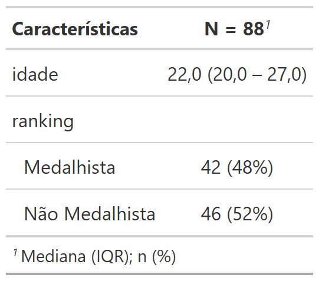
```


---

### Argumentos

#### `label`

Especifica os nomes das variáveis na tabela.


Uso: `label = variavel_1 ~ "Variável 1"`

```{r}
banco %>%
  tbl_summary(label = variavel_1 ~ "Variável 1") # apenas uma variavel
```

```{r eval=TRUE, echo=FALSE, out.width="30%"}
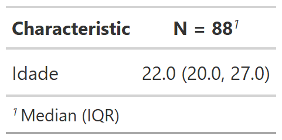
```


---


Para editar o nome de duas ou mais variáveis, criar uma *lista* com a função `list()`:

```{r}
nomes_variaveis <- list(var1 ~ "Variável 1",
                        var2 ~ "Variável 2")
banco %>%
  tbl_summary(label = nomes_variaveis) # tbl_summary(label = list(...))
```

```{r eval=TRUE, echo=FALSE, out.width="30%"}
knitr::include_graphics("img/fig3.png")
```

.footnote[
Uma outra forma é por meio do pacote [`labelled`](http://larmarange.github.io/labelled/).
]


???
O pacote mantém o nome das variáveis do banco, por isso é preciso mudar.

---

class: slide-code

---

### Exercício 1

```{r countdown, echo = FALSE, eval = TRUE}
countdown(minutes = 10, seconds = 0,
          font_size = "3em",
          top = 0,
          color_text = "#180D5B",
          color_running_background = "#fff",
          color_running_text = "#180D5B",
          color_finished_background = "#180D5B",
          color_finished_text = "#fff")
```


1. Crie uma tabela descritiva do banco de dados.

2. Crie uma lista (função `list()`) chamada `nomes_variaveis` e altere os nomes das variáveis:

.pull-left[

- idade *por* Idade;
  
- tempo_pratica *por* Tempo de prática;
  
- parte_selecao *por* Fez parte da seleção;
  
- ranking *por* Ranking;
]

.pull-right[

- p_harmoniosa *por* Paixão Harmoniosa;
  
- p_obsessiva *por* Paixão Obsessiva;

- criterio_p *por* Critério da Paixão.
  
]

---

3. Crie uma tabela descritiva utilizando as variáveis renomeadas:

  - utilize a lista `nomes_variaveis`;
  
  - utilize o argumento `label`.


---

#### `statistic`

Especifica a estatística descritiva apresentada na tabela, diferenciando variáveis **contínuas** (i.e., numéricas) e **categóricas**.

Exemplos:

```{r}
banco %>%
  tbl_summary(statistic = list(variavel_1 ~ "{median}"))
```

--

```{r}
banco %>%
  tbl_summary(statistic = c(variavel_1, variavel_2) ~ "{mean}")
```

--

```{r}
banco %>%
  tbl_summary(statistic = list(c(variavel_1, variavel_2) ~ "{mean}",
                               variavel_3 ~ "{n}"))
```


.footnote[
Outras maneiras de uso podem ser encontradas no [manual](http://www.danieldsjoberg.com/gtsummary/articles/tbl_summary.html#customize-output-1).
]

---

#### Contínuas

*Default* é mediana e quartis:

```{r}
banco %>%
  tbl_summary(label = nomes_variaveis)
```

```{r eval=TRUE, echo=FALSE, out.width="30%"}
knitr::include_graphics("img/fig3.png")
```


---


Mudando para média e desvio padrão:

```{r}
banco %>%
  tbl_summary(label = nomes_variaveis,
              statistic = list(nome_da_variavel ~ "{mean} ({sd})"))
```

```{r eval=TRUE, echo=FALSE, out.width="35%"}
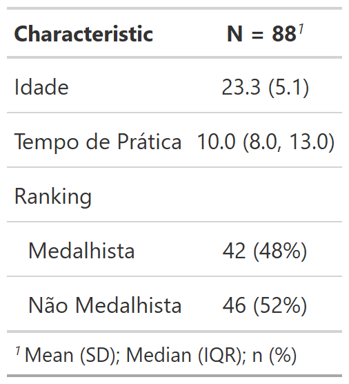
```

---

Usando a função `all_continuous()` para modificar todas as variáveis contínuas:

```{r}
banco %>%
  tbl_summary(label = nomes_variaveis,
              statistic = list(all_continuous() ~ "{mean} ({sd})"))
```


```{r eval=TRUE, echo=FALSE, out.width="30%"}
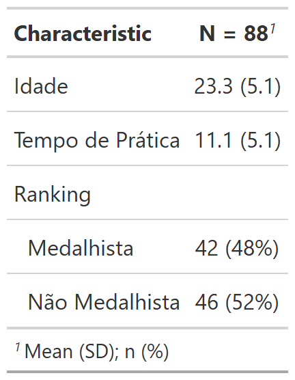
```

---


Medidas para variáveis contínuas:

- `{median}`: mediana

- `{p##}`: percentil, onde ## é um número de 0 a 100 (e.g., `p25` representa o 1º quartil)

- `{mean}`: média

- `{sd}`: desvio padrão


Outras medidas possíveis para essa função estão disponíveis em `?tbl_summary`.

---


#### Categóricas

*Default* é n e porcentagem:

```{r}
banco %>%
  tbl_summary(label = nomes_variaveis)
```

```{r eval=TRUE, echo=FALSE, out.width="35%"}
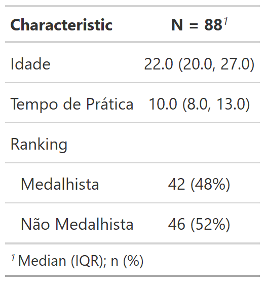
```

---

Mudando para n / N (amostra) e porcentagem:

```{r}
banco %>%
  tbl_summary(label = nomes_variaveis,
              statistic = list(nome_da_variavel ~ "{n} / {N} ({p}%)"))
```


```{r eval=TRUE, echo=FALSE, out.width="30%"}
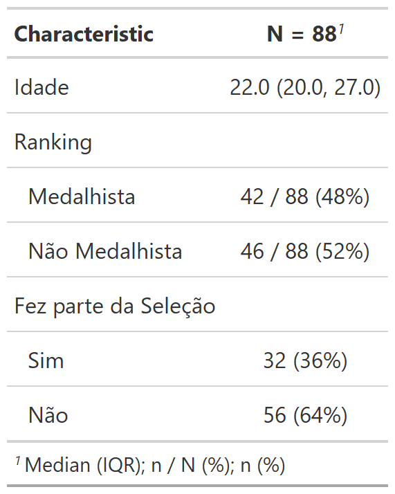
```


---

Usando a função `all_categorical()` para modificar todas as variáveis categóricas:

```{r}
banco %>%
  tbl_summary(label = nomes_variaveis,
              statistic = list(all_categorical() ~ "{n} / {N} ({p}%)"))
```


```{r eval=TRUE, echo=FALSE, out.width="30%"}
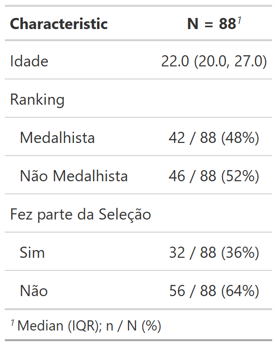
```


---

Medidas para variáveis categóricas:

- `{n}`: n da categoria

- `{N}`: n amostral

- `{p}`: porcentagem

Para colocar o símbolo `%`, coloque-o **fora** das chaves (`{p}%`).


---

Modificando as variáveis contínuas e categóricas:

```{r}
banco %>%
  tbl_summary(label = nomes_variaveis,
              statistic = list(all_categorical() ~ "{n} / {N} ({p}%)",
                               all_continuous() ~ "{mean} ({sd})"))
```

---

```{r eval=TRUE, echo=FALSE, out.width="35%"}
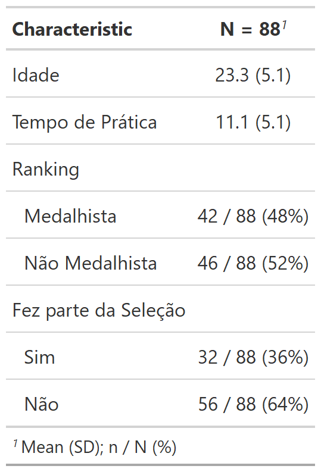
```

---

class: slide-code

---

### Exercício 2

```{r, echo = FALSE, eval = TRUE}
countdown(minutes = 10, seconds = 0, top = 0)
```


1. Crie uma tabela descritiva com *média* e *desvio padrão* para variáveis contínuas e *n amostral* para variáveis categóricas:

  - utilize o argumento `statistic`;

  - utilize a função `list()`;
  
  - lembre-se da função `all_continuous()` e `all_categorical()`;
  
  - lembre-se: média (*mean*), desvio padrão (*sd*) e n amostral (*n*).


---

#### `by`

Recebe **uma** variável categórica (e.g., `sexo`).

Estatísticas descritivas serão calculadas para cada **categoria** da variável (e.g., `feminino` e `masculino`).

É um ponto de partida para os testes de comparação de grupos.

```{r}
banco %>%
  tbl_summary(by = variavel_grupo)
```

```{r eval=TRUE, echo=FALSE, out.width="70%"}
knitr::include_graphics("img/fig9.png")
```

---

#### `digits`

Especifica o número de casas decimais para as medidas das variáveis **contínuas** e **categóricas**.

Uso: `digits = variavel_1 ~ #`, onde # indica o número de casas decimais.

```{r}
banco %>%
  tbl_summary(label = nomes_variaveis,
              statistic = list(all_categorical() ~ "{n} / {N} ({p}%)",
                               all_continuous() ~ "{mean} ({sd})"),
              digits = list(all_categorical() ~ 1,
                            all_continuous() ~ 0))
```


---

```{r eval=TRUE, echo=FALSE, out.width="40%"}
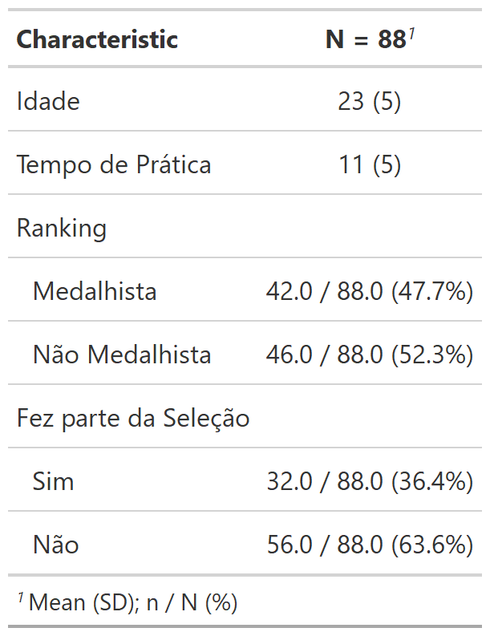
```


---

Para especificar a quantidade de casas decimais para **cada** medida descritiva (e.g., *n*, média e desvio padrão):

```{r}
banco %>%
  tbl_summary(label = nomes_variaveis,
              statistic = list(all_categorical() ~ "{n} / {N} ({p}%)",
                               all_continuous() ~ "{mean} ({sd})"),
              digits = list(all_categorical() ~ c(0, 0, 1),
                            all_continuous() ~ c(1, 1)))
```

Em `all_categorical() ~ c(0, 0, 1)`:

- `0` indica **nenhuma** casa decimal para o *n* `{n}`;

- `0` indica **nenhuma** casa decimal para o *n amostral* `{N}`;

- `1` indica **uma** casa decimal para a *porcentagem* `{p}`.

`r emo::ji("question")` O que acontecerá com as casas decimais da **média** e **desvio padrão**?


---

```{r eval=TRUE, echo=FALSE, out.width="40%"}
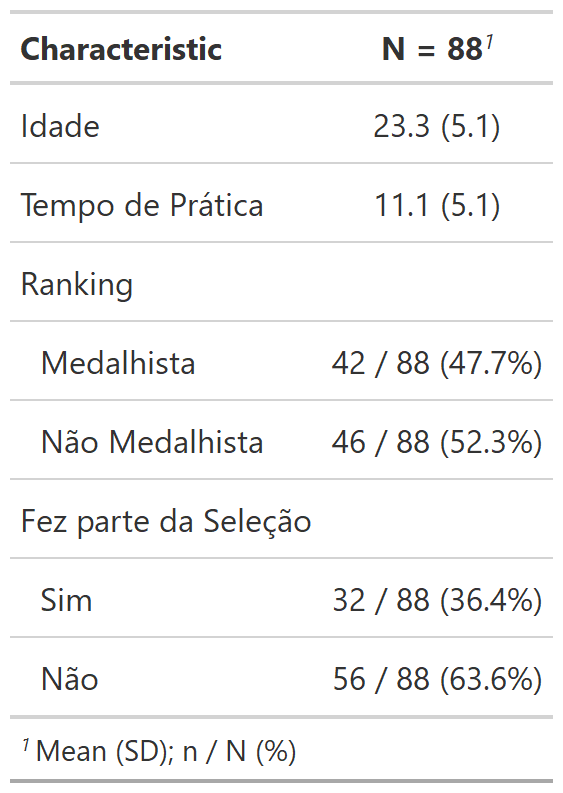
```

---

class: slide-code

---

### Exercício 3


1. Faça uma tabela em função da variável categórica *Ranking*:

  - utilize o argumento `by`.


```{r, echo = FALSE, eval = TRUE}
countdown(minutes = 10, seconds = 0, top = 0)
```


---


### [`add_p()`](http://www.danieldsjoberg.com/gtsummary/reference/add_p.tbl_summary.html)

É uma função usada para **comparar** grupos.

Adiciona uma coluna de valores-p automaticamente.

É utilizada após a função `tbl_summary(..., by = variavel_grupo)`.

```{r}
banco %>%
  tbl_summary(by = variavel_grupo) %>%
  add_p()
```

```{r eval=TRUE, echo=FALSE, out.width="70%"}

```

???
É usada depois da tbl_summary() porque o primeiro argumento do add_p() recebe a saída da tbl_summary() (objeto tbl_summary).


---

### Argumentos

#### `test`

Especifica o teste estatístico que será utilizado para comparar os grupos.


```{r}
banco %>%
  tbl_summary(by = variavel_grupo) %>%
  add_p(test = list(all_continuous() ~ "wilcox.test",
                    all_categorical() ~ "chisq.test.no.correct"))
```

```{r eval=TRUE, echo=FALSE, out.width="50%"}
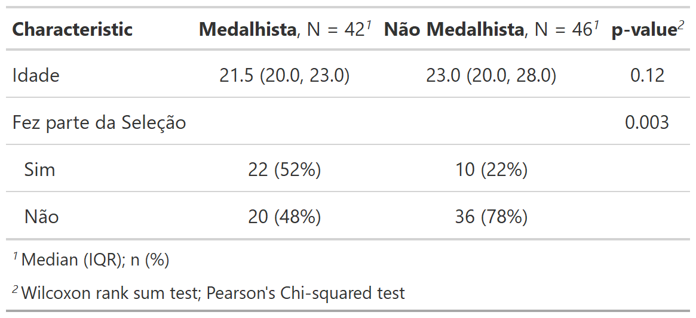
```

---

Testes disponíveis na função `add_p()`:

- **Contínuas**:

  - Teste *t* (`"t.test"`);

  - Teste U de Mann-Whitney (`"wilcox.test"`) - _**default**_ quando a *variável categórica* possui 2 categorias;
  
  - ANOVA *one-way* (`"aov"`);
  
  - Teste de Kruskal-Wallis (`"kruskal.test"`) - _**default**_ quando a *variável categórica* possui 3 ou mais categorias;
  
  - Teste *t* pareado (`"paired.t.test"`);
  
  - Teste de Wilcoxon (`"paired.wilcox.test"`).
  
  
---

- **Categóricas**:

  - Qui-quadrado (`"chisq.test"`);

  - Qui-quadrado sem correção (`"chisq.test.no.correct"`) - _**default**_ quando a quantidade de pessoas em cada célula é $\geq$ 5;
  
  - Teste de Fisher (`"fisher.test"`) - _**default**_ quando a quantidade de pessoas em pelo menos uma célula é < 5;
  
  - Teste de Mcnemar (`"mcnemar.test"`).
  
<br>

Para conferir outros testes disponíveis ou para aprender a criar uma nova função de testes, veja o [manual](http://www.danieldsjoberg.com/gtsummary/reference/tests.html).


---

class: slide-code

---

name: exercicio-4

### Exercício 4

1. Crie uma tabela de comparação em função da variável *Fez parte da Seleção*:

  - utilize o argumento `by` na função `tbl_summary()`;
  
  - utilize a função `add_p()`.
  
2. Modifique o teste de comparação das variáveis contínuas para teste *t*:

  - lembre-se da função `all_continuous()`.

```{r, echo = FALSE, eval = TRUE}
countdown(minutes = 10, seconds = 0, top = 0)
```


---

#### `pvalue_fun`

É usado para modificar o formato dos valores-p (*opcional*). *Default* é uma casa decimal.

Esse argumento recebe uma função. É recomendado usar a função `style_pvalue()` do próprio pacote ([clique aqui](http://www.danieldsjoberg.com/gtsummary/reference/style_pvalue.html) para saber mais).

```{r}
banco %>%
  tbl_summary(by = variavel_grupo) %>%
  add_p(pvalue_fun = \(x) style_pvalue(x, digits = 3, decimal.mark = ","))
```


```{r eval=TRUE, echo=FALSE, out.width="70%"}
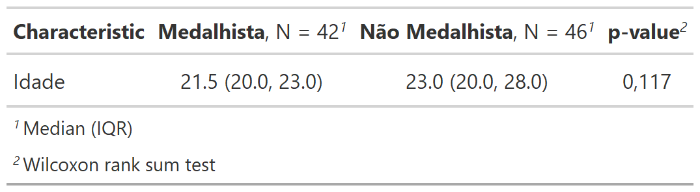
```


???
É recomendado usar a função style_pvalue() porque criar uma outra função de p-value é difícil. Essa função já tem alguns padrões criados para facilitar.


---

## Funções extras

### `add_overall()`

É utilizada após a função `tbl_summary(..., by = variavel)`.

Cria uma nova coluna com as estatísticas descritivas *gerais* das variáveis.


```{r}
banco %>%
  tbl_summary(by = variavel_grupo) %>%
  add_overall()
```

```{r eval=TRUE, echo=FALSE, out.width="50%"}
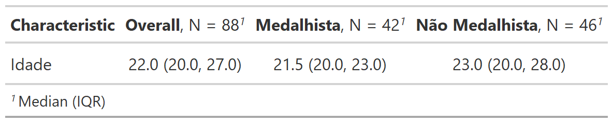
```


???
É usada depois da tbl_summary() porque o primeiro argumento do add_overall() recebe a saída do tbl_summary.


---

#### `col_label`

É um argumento que modifica o nome da coluna adicionada pela função `add_overall()`.

O *default* é `"**Overall**, N = {N}"`. Vamos trocar para `"**Total**, N = {N}"`.

```{r}
banco %>%
  tbl_summary(by = variavel_grupo) %>%
  add_overall(col_label = "**Total**, N = {N}")
```

```{r eval=TRUE, echo=FALSE, out.width="70%"}
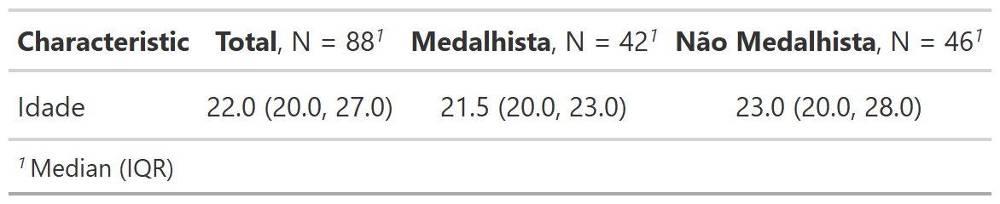
```


---

- `bold_labels()`: Coloca os **nomes** das variáveis em **negrito**.

- `italicize_labels()`: Coloca os *nomes* das variáveis em *itálico*.

```{r}
banco %>%
  tbl_summary() %>%
  bold_labels()
```

```{r eval=TRUE, echo=FALSE, out.width="40%"}
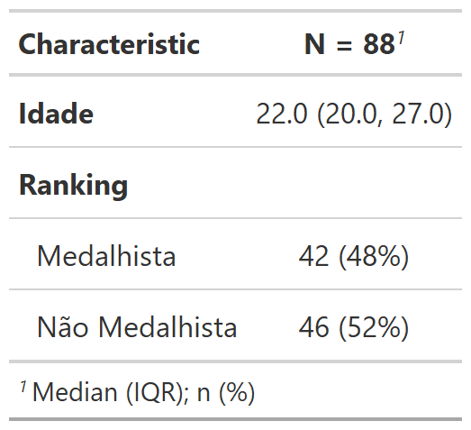
```

---

- `bold_levels()`: Coloca as **categorias** das variáveis em **negrito**.

- `italicize_levels()`: Coloca os *categorias* das variáveis em *itálico*.

```{r}
banco %>%
  tbl_summary() %>%
  italicize_levels()
```

```{r eval=TRUE, echo=FALSE, out.width="40%"}
knitr::include_graphics("img/fig18.png")
```

---

- `bold_p()`: Coloca os valores-p em **negrito** de acordo com algum nível de significância (*default* é < 0.05).

```{r}
banco %>%
  tbl_summary(by = variavel_grupo) %>%
  add_p() %>%
  bold_p(t = 0.2)
```

```{r eval=TRUE, echo=FALSE, out.width="70%"}
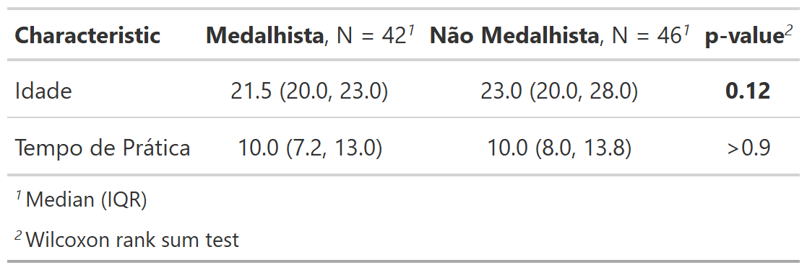
```

---

### `theme_gtsummary_language()`

Essa função pode ser utilizada para *traduzir* algumas informações padronizadas no pacote `gtsummary`.

O argumento `language = "pt"` muda o idioma para português.

Utilize essa função **antes** de executar os códigos que criam a tabela.

```{r}
theme_gtsummary_language(language = "pt") # muda o idioma padrao
banco %>%                                 # cria a tabela
  tbl_summary()
```

```{r eval=TRUE, echo=FALSE, out.width="30%"}
knitr::include_graphics("img/fig20.png")
```

---

Você também pode alterar a marcação de decimal para `","` usando o argumento `decimal.mark = ","`.

```{r}
theme_gtsummary_language(language = "pt",
                         decimal.mark = ",")
banco %>%
  tbl_summary()
```

```{r eval=TRUE, echo=FALSE, out.width="50%"}
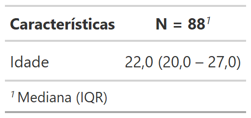
```

.footnote[
Para voltar ao tema padrão, use `reset_gtsummary_theme()`.
]

---

name: salvar

### Como salvar a tabela?

O pacote `gtsummary` não consegue salvar a tabela em *Word*. Precisaremos da ajuda do pacote [`flextable`](https://davidgohel.github.io/flextable/).

```{r}
install.packages("flextable")
library(flextable)
```

--

#### Passo a passo para salvar a tabela em *Word*

**1.** <span style="color: #180D5B; font-weight: 600">Guardar</span> a tabela em um objeto:

```{r}
minha_tabela <- banco %>%
                tbl_summary(by = variavel_grupo) %>%
                add_p() %>%
                bold_labels()
```

---

**2.** <span style="color: #180D5B; font-weight: 600">Converter</span> a tabela em `flextable` usando a função `gtsummary::as_flex_table()`:

```{r}
minha_tabela <- minha_tabela %>%
                as_flex_table()
```

<br>

--


**3.** <span style="color: #180D5B; font-weight: 600">Salvar</span> tabela em um documento *Word* com a função `flextable::save_as_docx()`:

```{r}
save_as_docx(minha_tabela, path = "tabela-1.docx")
```

<br>

Um novo documento *Word* será criado com a tabela inserida.

**Observação:** lembre-se do `.docx`!

---

### Referências

Para você dominar os tópicos abordados nessa apresentação:

- Livro [*R for Data Science*](https://r4ds.had.co.nz/index.html), do Hadley Wickham e Garrett Grolemund.

- Livro [*Advanced R*](https://adv-r.hadley.nz/index.html), do Hadley Wickham.

- [Website](http://www.danieldsjoberg.com/gtsummary/index.html) do pacote `gtsummary`.


<br>

> Essa apresentação foi construída no `RStudio` com os recursos dos pacotes `xaringan`, `xaringanthemer`, `xaringanExtra` e `countdown`.


---

class: obrigado

